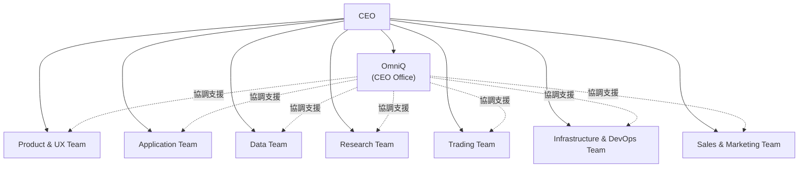

# QadrisCorp 組織架構（org.md）
Version: 2.4  
Last Updated: 2025-12-05  
Purpose: 描述 QadrisCorp 的正式組織架構、責任分工與部門任務。

---

# 🏢 QadrisCorp — 組織架構概述

QadrisCorp 採用 **七大部門制 + CEO Office**，由 AI Agent 協助各部門運作，  
組織目的在於支援：

- 多資料來源、資料庫  
- 多產品（TWMarketWatch、Beartzen、MCI）  
- API 服務（Qadris Web API）  
- 策略研究與交易  
- 部署與自動化  
- 行銷與客戶導向產品迭代

---

# 👔 CEO（執行長）職責

公司設有 **CEO（Chief Executive Officer）** 職位，負責：

- **整體決策**：公司策略方向與重大專案核准
- **部門協調**：跨部門協作流程規劃與調整
- **最終裁決**：部門衝突的仲裁與最終決定權
- **治理監督**：公司治理規範的制定與維護

CEO 不參與日常部門執行工作，但擁有所有部門的監督與裁決權。

---

# 🎖️ CEO Office — OmniQ（幕僚長 / 全能助理）

**OmniQ** 是 CEO 的幕僚長與全能助理，定位為「管理中樞」：

| 項目 | 說明 |
|------|------|
| **角色定位** | CEO 的右手、管理中樞、跨部門協調者 |
| **核心職責** | 跨部門資訊彙整、營運支援、行政任務、流程維護 |
| **工作範圍** | 不屬於任何特定部門的灰色地帶任務 |
| **權限邊界** | 不介入任何部門的技術權責，不做專業決策 |

### OmniQ 的主要任務

- 協助 CEO 追蹤各部門狀態與專案進度
- 整理跨部門會議結論與行動項目
- 產出行政類文件（會議紀錄、進度報告、狀態摘要）
- 處理 CEO 指派的臨時性任務
- 協調部門間資訊傳遞
- 提供任務優先序建議

### OmniQ 不做的事

- 不做任何部門的技術決策
- 不取代部門的專業職責
- 不代替部門發言或承諾

---

# 🧩 Mermaid 組織架構圖

# QadrisCorp 部門組織表（Department Structure）

| 部門                               | 負責人（AI Agent） | 核心職掌（部門任務）                                        | 主要工作內容                                                                                                                                                                                                                          | 產品 / 專案範圍                                                                                                                                           |
| -------------------------------- | ------------- | ----------------------------------------------------------- | --------------------------------------------------------------------------------------------------------------------------------------------------------------------------------------------------------------------------------------- | --------------------------------------------------------------------------------------------------------------------------------------------------- |
| **CEO Office**                   | **OmniQ**     | CEO 幕僚長：跨部門協調、營運支援、行政任務、流程維護                     | - 彙整各部門狀態與進度資訊 - 整理跨部門會議結論與行動項目 - 產出行政類文件（會議紀錄、進度報告） - 協助 CEO 追蹤專案與任務 - 處理不落在任何部門的臨時性任務 - 協調部門間資訊傳遞                                                                          | - 公司層級文件維護 - 會議管理與追蹤 - 跨部門協調支援                                                                                              |
| **Product & UX Team**            | **Helena**    | 負責所有產品的「要做什麼、長什麼樣子、給誰用」：產品願景、功能規劃、UX 流程、畫面結構、說明文件 | - 撰寫產品規格書（Product Spec） - 規劃畫面區塊與操作流程（Flow） - 決定要呈現哪些欄位、指標與命名方式 - 撰寫產品說明、FAQ、教學、欄位解釋 - 維護整體產品風格與一致性（Design / UX Guidelines）                                                                                         | - TWMarketWatch 產品規格 - Beartzen（個股儀表板）規格 - MCI 指標呈現規格 - Qadris Docs & Developer Portal 結構                                                  |
| **Application Team**             | **Apprex**    | 負責「如何實作」：後端 API、前端網頁、系統整合與部署                      | - 實作 FastAPI 後端（Router / Service / Schema） - 開發前端頁面（HTML / JS / CSS） - 串接 DataRetriever / MeasureRetriever - 圖表與互動（ECharts / Plotly 等） - 與 Infrastructure Team 協作部署（Docker / GitHub Pages 等）                        | - QadrisWebAPI 實作 - TWMarketWatch 後端與前端 - Beartzen 系統實作 - MCI API 與前端呈現                                                                    |
| **Data Team**                    | **Qadriaw**   | 負責資料全生命週期：資料來源、清洗、標準化、欄位設計、資料管線與統一資料入口            | - 建立 raw → std → measuredb pipeline - 設計與維護 DataRetriever / MeasureRetriever - 設計資料表 schema（欄位、索引、型別、DECIMAL 精度等） - 實作 TWMarketWatch / MCI 所需資料計算腳本 - 資料品質監控與異常檢查                                                   | - TWFinCrawler / RawDataImporter - StdDataImporter / TableSync - DataRetriever / MeasureRetriever 核心 - TWMarketWatch 數據計算 - MCI 所需的輸入資料 |
| **Research Team**                | **Fama**      | 負責策略與因子研究：定義因子、設計回測、驗證策略有效性與風險                    | - 定義技術、基本面、量價、風險等各類因子公式 - 進行因子回測、分群測試（Group Test） - 評估 Sharpe、最大回撤與風險指標 - 避免 look-ahead bias / survivorship bias - 設計像 MCI 這類「市場狀態指標」的理論邏輯                                                                          | - FactorGroupTesting - FactorBackTesting - MeasureDefinitionManager（因子定義） - MCI 核心邏輯（若定位為策略型市場指標）                                          |
| **Trading Team**                 | **Renaisk**   | 負責將策略落地到實際市場：自動化交易、風控、倉位管理、帳務管理                   | - 設計自動化交易流程與下單邏輯 - 制定風控規則（單筆風險、最大虧損、曝險上限） - 評估滑價、成本與流動性 - 建立持倉與 PnL 計算邏輯 - 調整異常狀況處理流程（API 掛掉、價格異常等）                                                                                                                 | - QadrisTradingSystem（自動交易引擎） - QadrisAccountingSystem（PnL 系統） - 模擬交易流程設計                                                                     |
| **Infrastructure & DevOps Team** | **Opskova**   | 負責底層基礎設施與自動化：伺服器架構、Docker、CI/CD、監控、備份與效能          | - 規劃 BearQadris 伺服器架構 - 設計與維護 Dockerfile / docker-compose - 建立 GitLab CI / GitHub Actions pipeline - 部署 FastAPI / QadrisWebAPI（Uvicorn / Gunicorn） - 設計 DB snapshot、備份與還原流程 - 監控系統資源與服務狀態（monitoring / alerting） | - BearQadris Infrastructure（伺服器環境） - Qadris CI/CD Pipeline - Docker 化服務（DB、API、計算服務） - 系統監控與備份                                             |
| **Sales & Marketing Team**       | **Leon**      | 負責對外溝通與商業化：產品定位、行銷內容、訂閱方案、客戶管理                    | - 規劃產品定位與目標客群 - 撰寫產品文案、方案說明、Landing Page - 設計 API 訂閱與 SaaS 收費模式（Free / Pro / Enterprise） - 規劃 newsletter、Blog、YouTube 行銷內容 - 收集使用者回饋並回饋 Product Team                                                                | - QadrisWebAPI 商業化 - TWMarketWatch / Beartzen / MCI 行銷 - 未來 SaaS 方案策略 & 客戶成功                                                                  |

